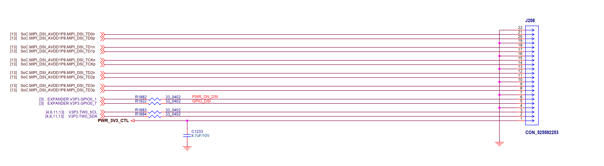

# Synaptics Astra SDK 本地 build 完整指南

> 一份覆盖**从零搭建、幂等再跑、验证、维护、阅读源码**全流程的文档。
>
> 目标分支：`scarthgap_6.12_v2.3.0` · 目标板：**sl2619** (eMMC) · 主 image：`astra-media`
>
> **TD7800 项目目标已在 2026-07-10 改为 SL1680 EVK。** 原 SL2619 构建指南保留作历史参考；TD7800 后续工作以 [§14](#14-sl1680-evk--td7800-1280720-lvds-panel-接手状态2026-07-10) 为准，§14 覆盖 §13 中的 `sl2619/klamath` 假设。

## 目录

1. [项目概览](#1-项目概览)
2. [系统要求 vs 实际机器](#2-系统要求-vs-实际机器)
3. [幂等执行计划（Runbook）](#3-幂等执行计划runbook)
4. [验证脚本与最近一次验证结果](#4-验证脚本与最近一次验证结果)
5. [踩过的坑 & 修法](#5-踩过的坑--修法)
6. [构建产物](#6-构建产物)
7. [日常使用](#7-日常使用)
8. [用 Source Insight 看源码](#8-用-source-insight-看源码)
9. [Variants（其他 build 场景）](#9-variants其他-build-场景)
10. [维护 & 清理](#10-维护--清理)
11. [关键文件 / 路径速查](#11-关键文件--路径速查)
12. [辅助脚本清单](#12-辅助脚本清单)
13. [TD7800 触控 + HDMI→LVDS 显示集成方案](#13-td7800-触控--hdmilvds-显示集成方案)
14. [SL1680 EVK + TD7800 1280×720 LVDS panel 接手状态](#14-sl1680-evk--td7800-1280720-lvds-panel-接手状态2026-07-10)

---

## 1. 项目概览

仓库 [`synaptics-astra/sdk`](https://github.com/synaptics-astra/sdk) 是 Synaptics Astra SoC（SL1620 / SL1640 / SL1680 / SL2611 / SL2615 / SL2619）的 **Yocto BSP 启动模板**。`main` 分支为空，代码全在版本分支上。

Release 页同时提供两类资产：
- **预编译镜像**：每个板子一份（直接刷板）
- **Standalone toolchain**：交叉编译工具链（SDK 之外开发应用）

本文档走的是「**完整 Yocto 源码 build**」路线。

### SL2619 三个 MACHINE 变体

| MACHINE | 启动介质 | 产物形态 | 备注 |
|---|---|---|---|
| `sl2619` | eMMC | `SYNAIMG/*.subimg.gz` | 主流量产配置（本文档主线） |
| `sl2619nand` | NAND flash | `SYNAIMG/*.subimg.gz`（含 NAND overlay） | 需要 NAND 版硬件 |
| `sl2619usb` | USB recovery | `synausbimg/` | 应急刷机 |

### 可选 image 目标

`meta-synaptics/recipes-bsp/images/` 下的顶层 `.bb`：

| Target | 用途 |
|---|---|
| `astra-media` | 完整媒体栈 + SSH + debug-tweaks（**本文档主线**） |
| `astra-media-oobe` | Out-of-Box Experience 首次开机引导 |
| `astra-core` | 精简核心 |
| `astra-tiny` | 最小镜像 |
| `core-image-initramfs-boot` | 仅 initramfs |

---

## 2. 系统要求 vs 实际机器

| 项目 | 官方要求 | 本机实际 |
|---|---|---|
| OS | Ubuntu 22.04 LTS | WSL2 Ubuntu 22.04.5 LTS |
| CPU | 16 cores x86_64 | i9-14900KF (24 物理 / 32 逻辑) |
| RAM | 32 GB | 64 GB 物理（给 WSL 48 GB） |
| 磁盘 | 150 GB | WSL 默认 1 TB VHDX（770 GB 可用） |
| 构建时长 | ~2 h on AWS | **实测 1 h 52 min** |

---

## 3. 幂等执行计划（Runbook）

每步开头的"幂等检查"决定要不要跳过。在已成功 build 过的机器上整套跑下来应该全是 no-op。

### Step 1 — 安装 Ubuntu-22.04 到 WSL

**幂等检查**（PowerShell）：
```powershell
wsl -l -v | Select-String "Ubuntu-22.04"
```
有输出 → 跳过。

**执行**：
```powershell
wsl --install -d Ubuntu-22.04 --no-launch
```

`--no-launch` 避开首次交互式账号设置，方便用脚本完成初始化。

### Step 2 — 创建 astra 用户 + 配置默认登录

> Yocto bitbake 拒绝 root，必须用普通用户。

**幂等检查**：
```powershell
wsl -d Ubuntu-22.04 -u root -- id astra 2>$null
```
返回 uid 行 → 跳过。

**执行**：
```powershell
wsl -d Ubuntu-22.04 -u root -- bash -lc "
  useradd -m -s /bin/bash -G sudo astra &&
  echo 'astra ALL=(ALL) NOPASSWD:ALL' > /etc/sudoers.d/astra-nopw &&
  chmod 440 /etc/sudoers.d/astra-nopw &&
  printf '[user]\ndefault=astra\n[boot]\nsystemd=true\n' > /etc/wsl.conf
"
wsl --shutdown
```

### Step 3 — 配置 WSL2 资源（`.wslconfig`）

**幂等检查**：
```powershell
Test-Path C:\Users\hrl12\.wslconfig
```
存在 → 检查内容；不存在 → 写入。

**目标内容** `C:\Users\hrl12\.wslconfig`：
```ini
[wsl2]
memory=48GB
processors=24
swap=16GB
```

写完执行 `wsl --shutdown` 让配置生效。

### Step 4 — 安装 Yocto 主机依赖

**幂等预检**：
```bash
for t in gcc make git python3 chrpath socat texi2any diffstat zstd lz4 rsync; do
  command -v $t >/dev/null || { echo NEED_INSTALL; break; }
done
```

**执行**：
```bash
sudo apt-get update
sudo apt-get install -y \
  gawk wget git diffstat unzip texinfo gcc build-essential \
  chrpath socat cpio python3 python3-pip python3-pexpect \
  xz-utils debianutils iputils-ping python3-git python3-jinja2 \
  python3-subunit zstd liblz4-tool file locales libacl1 \
  ca-certificates curl lz4 bzip2 rsync
sudo locale-gen en_US.UTF-8
```

### Step 5 — 全局 git 协议改写（破解 `git://` 屏蔽）

GitHub 已停 `git://`，公司防火墙也常屏蔽 9418 端口。Yocto 的几个层（meta-selinux / meta-virtualization / meta-lts-mixins）的 `.gitmodules` 里还在用 `git://`，需要全局 rewrite。

**幂等检查**：
```bash
git config --global --get url.https://.insteadof
```
返回 `git://` → 跳过。

**执行**：
```bash
git config --global url."https://".insteadOf "git://"
git config --global advice.detachedHead false
```

### Step 6 — Clone SDK 源码 + submodule

**幂等检查**：
```bash
# 注意 -e 不是 -d，submodule 的 .git 是 gitfile 不是目录
test -e ~/sdk/.git && test -e ~/sdk/poky/.git && test -e ~/sdk/meta-synaptics/.git \
  && cd ~/sdk && [ "$(git rev-parse --abbrev-ref HEAD)" = "scarthgap_6.12_v2.3.0" ]
```
通过 → 跳过 clone，仅同步 submodule。

**执行（全新 clone）**：
```bash
cd ~
git clone -b scarthgap_6.12_v2.3.0 --recurse-submodules \
  https://github.com/synaptics-astra/sdk
```

**执行（仅补齐 submodule）**：
```bash
cd ~/sdk
git submodule sync --recursive
git submodule update --init --recursive --progress
```

> **重要**：源码必须在 ext4（`~/sdk`），**绝不要放在 `/mnt/c/` 或 `/mnt/d/`**。DrvFs 跨文件系统对 30 万小文件慢 10-100 倍。

完整 submodule 清单（10 个，clone 完总共 756 MB）：

| Submodule | 用途 |
|---|---|
| `poky` | Yocto 核心（pinned `yocto-5.0.9`） |
| `meta-synaptics` | Synaptics BSP 层 |
| `meta-openembedded` | OE 标准扩展层 |
| `meta-browser` | Chromium 层 |
| `meta-clang` | LLVM/Clang 层 |
| `meta-qt5` | Qt5 层 |
| `meta-swupdate` | SWUpdate OTA 层 |
| `meta-virtualization` | 容器/虚拟化层 |
| `meta-selinux` | SELinux 层 |
| `meta-lts-mixins` | LTS 内核 mixins |

### Step 7 — 生成 build-sl2619 配置

**幂等检查**：
```bash
test -f ~/sdk/build-sl2619/conf/local.conf \
  && grep -q '^MACHINE.*sl2619' ~/sdk/build-sl2619/conf/local.conf
```
通过 → 跳过。

**执行**：
```bash
cd ~/sdk
export MACHINE=sl2619
export ACCEPT_SYNA_EULA=1
. meta-synaptics/setup/setup-environment
```

`setup-environment` 会自动 `cd` 进 `build-sl2619/`，从 `meta-synaptics/conf/templates/astra/local.conf.sample` 生成 `conf/local.conf`、从同目录 `bblayers.conf.sample` 生成 `conf/bblayers.conf`。默认 `DISPLAY_SERVER=wayland`、`OPTEE_TA_ENC=prod`。

> EULA 文本在 `~/sdk/meta-synaptics/EULA.rst`（299 行，April 4, 2024 v1.0）。`ACCEPT_SYNA_EULA=1` 跳过交互式 y/n 提示 —— 法律责任自行确认。

### Step 8 — 执行 bitbake 长任务（detached）

**幂等检查**：
```bash
test -f ~/sdk/build-sl2619/tmp/deploy/images/sl2619/SYNAIMG/emmc_image_list \
  && test -f ~/sdk/build-sl2619/tmp/deploy/images/sl2619/SYNAIMG/rootfs.subimg.gz
```
通过 → 已有完整产物。要增量重 build 也可继续（bitbake 自己用 sstate 决定哪些任务 re-run）。

**执行**（必须用三层保险脱离启动壳）：
```bash
cd ~/sdk
setsid nohup bash -c '
  cd ~/sdk &&
  export MACHINE=sl2619 ACCEPT_SYNA_EULA=1 &&
  . meta-synaptics/setup/setup-environment &&
  exec bitbake astra-media
' >> ~/sdk/build-sl2619/build.log 2>&1 < /dev/null &
disown
```

**为什么需要 `setsid nohup ... & disown`**：bitbake 60-120 分钟，Bash/PowerShell 单次调用最长 10 分钟会被 SIGTERM 杀掉。三层保险：
- `setsid` —— 创建新 session 脱离控制终端
- `nohup` —— 忽略 SIGHUP
- `& disown` —— 从 shell job table 移除

**监控进度**（另开 shell）：
```bash
tail -F ~/sdk/build-sl2619/build.log | \
  grep -E --line-buffered "ERROR|FAILED|Tasks Summary|exit="
```

**判断完成**：
```bash
grep "Tasks Summary" ~/sdk/build-sl2619/build.log
grep "^=== bitbake astra-media end:" ~/sdk/build-sl2619/build.log
```
出现 `Tasks Summary: Attempted N tasks of which 0 didn't need to be rerun and all succeeded.` + `exit=0` → 成功。

---

## 4. 验证脚本与最近一次验证结果

### 4.1 验证脚本 `idempotent-check.sh`

完整脚本在 `D:\Claude code\Case6_Astra\idempotent-check.sh`，运行方式：

```powershell
wsl -d Ubuntu-22.04 -- bash "/mnt/d/Claude code/Case6_Astra/idempotent-check.sh"
```

脚本会逐项检查 Runbook Step 4-8 的每个幂等 guard，输出彩色 ✓/✗，并列出产物文件大小、磁盘占用。**只读，无副作用**。

脚本核心检查逻辑：

```bash
# Step 4: 主机工具
for t in gcc make git python3 chrpath socat texi2any diffstat zstd lz4 rsync ...; do
  command -v "$t" >/dev/null || fail
done

# Step 5: git:// rewrite
[ "$(git config --global --get url.https://.insteadof)" = "git://" ]

# Step 6: 源码树（用 -e 因为 submodule .git 是 gitfile）
[ -e ~/sdk/.git ] && [ -e ~/sdk/poky/.git ] && [ -e ~/sdk/meta-synaptics/.git ]
git -C ~/sdk submodule status --recursive | grep -E '^[-+]'   # 出错才会有 + / -

# Step 7: build conf
grep -q '^MACHINE.*sl2619' ~/sdk/build-sl2619/conf/local.conf

# Step 8: 11 个产物文件 + build log "all succeeded"
```

### 4.2 最近一次（2026-05-23 17:21 build 完毕后）的验证结果

```
Step 4 — Yocto host tools
  ✓ all required host tools present
  ✓ en_US.UTF-8 locale generated

Step 5 — git:// rewrite
  ✓ url rewrite: git:// → https://

Step 6 — SDK source tree
  ✓ ~/sdk and key submodules present
  · branch: heads/scarthgap_6.12_v2.3.0
  ✓ all 10 submodules in sync

Step 7 — build-sl2619 conf
  ✓ conf/local.conf exists with MACHINE=sl2619
  · MACHINE ??= "sl2619"
  · DISTRO ?= "poky"
  · LICENSE_FLAGS_ACCEPTED = "commercial Synaptics-EULA ..."

Step 8 — build artifacts
  ✓ SYNAIMG/emmc_image_list (4.0K)
  ✓ SYNAIMG/bl.subimg.gz (380K)
  ✓ SYNAIMG/boot.subimg.gz (15M)
  ✓ SYNAIMG/preboot.subimg.gz (76K)
  ✓ SYNAIMG/tzk.subimg.gz (264K)
  ✓ SYNAIMG/sysmgr.subimg.gz (124K)
  ✓ SYNAIMG/rootfs.subimg.gz (343M)
  ✓ SYNAIMG/home.subimg.gz (113M)
  ✓ Image-sl2619.bin (17M)
  ✓ astra-media-sl2619.rootfs.ext4.gz (311M)
  ✓ astra-media.swu (330M)

Build log status
  ✓ NOTE: Tasks Summary: Attempted 9624 tasks of which 0 didn't
    need to be rerun and all succeeded.
  · === bitbake astra-media end: 2026-05-23T17:21:22+08:00 exit=0 ===

Disk usage
  151G  /home/astra/sdk/build-sl2619/tmp
   24G  /home/astra/sdk/build-sl2619/downloads
  9.2G  /home/astra/sdk/build-sl2619/sstate-cache
  /dev/sdd  1007G  187G  770G  20% /

Summary
  ✓ All artifacts present — plan fully realized; no rebuild needed.
```

---

## 5. 踩过的坑 & 修法

| 现象 | 根因 | 修法 |
|---|---|---|
| `fatal: clone of 'git://...' failed` | GitHub/yoctoproject 已停 git:// 或防火墙拦 9418 | Step 5 的 `insteadOf` 改写 |
| `setup-environment` 卡住无输出 | 等 EULA 交互 y/n | 必须 `export ACCEPT_SYNA_EULA=1` |
| build 跑 10 分钟后被杀 exit 15 | wrapper shell SIGTERM 传递到 bitbake | Step 8 的 `setsid nohup ... & disown` |
| 单文件 IO 慢得离谱 | 仓库放在 `/mnt/*` 走 DrvFs | 仓库必须在 `~/` 下的 ext4 |
| OOM-killed | WSL 默认 RAM 配额不够（8 GB） | Step 3 的 `.wslconfig` 调到 48 GB |
| `do_fetch` 找不到上游包 | 公司代理 / 网络限速 | 设 `https_proxy` / `http_proxy` 后再 build；或先 `bitbake -c fetchall astra-media` 提前拉包 |
| bitbake 报 root 错误 | 用 root 跑了 | 必须切到 astra 用户（默认就是） |
| `idempotent-check.sh` 报 "SDK not cloned" 但实际有 | `.git` 在 submodule 里是 gitfile 不是目录 | 用 `-e` 不是 `-d` |
| 产物 `du -h` 显示 0 | 顶层是 symlink | 用 `du -hL` 跟随 symlink |

---

## 6. 构建产物

主路径：`~/sdk/build-sl2619/tmp/deploy/images/sl2619/`

Windows 访问：`\\wsl.localhost\Ubuntu-22.04\home\astra\sdk\build-sl2619\tmp\deploy\images\sl2619\`

### 6.1 刷板镜像（`SYNAIMG/` 子目录，共 1.3 GB）

按 `emmc_image_list` 顺序、用 U-boot dongle 把这些烧到 eMMC：

| 文件 | 大小 | 用途 |
|---|---|---|
| `bl.subimg.gz` | 380 K | Bootloader |
| `boot.subimg.gz` | 15 M | Boot 分区 |
| `preboot.subimg.gz` | 76 K | Preboot |
| `tzk.subimg.gz` | 264 K | TrustZone kernel |
| `sysmgr.subimg.gz` | 124 K | System manager |
| `rootfs.subimg.gz` | 343 M | 主 rootfs（压缩） |
| `rootfs_s.subimg.0/1/2` | 283+300+262 M | 分片 rootfs |
| `home.subimg.gz` | 113 M | `/home` 分区 |
| `emmc_part_list` / `emmc_image_list` | — | 烧录顺序清单 |

### 6.2 其他常用产物（`images/sl2619/` 顶层）

| 文件 | 大小 | 用途 |
|---|---|---|
| `Image-sl2619.bin` | 17 M | Linux kernel |
| `astra-media-sl2619.rootfs.ext4` | 1.2 G | 完整 rootfs（未压缩） |
| `astra-media-sl2619.rootfs.ext4.gz` | 311 M | 完整 rootfs（gz） |
| `astra-media.swu` | 330 M | SWUpdate OTA 包 |
| `*.manifest` | — | rootfs 包清单 |
| `*.spdx.tar.zst` | 3.3 M | SBOM |

### 6.3 磁盘占用

| 目录 | 大小 | 能否删 |
|---|---|---|
| `build-sl2619/tmp` | 151 GB | 可删（下次靠 sstate 重建） |
| `build-sl2619/downloads` | 24 GB | 保留可加速二次 build |
| `build-sl2619/sstate-cache` | 9.2 GB | **强烈保留**（共享状态缓存） |
| `~/sdk/`（源码） | 756 MB | 保留 |

---

## 7. 日常使用

### 7.1 启动 WSL 进入工作目录

```powershell
wsl -d Ubuntu-22.04
```

```bash
cd ~/sdk                  # 源码
cd ~/sdk/build-sl2619     # build 产物
```

### 7.2 把 22.04 设为默认（这样 `wsl` 不加 `-d` 也进）

```powershell
wsl --set-default Ubuntu-22.04
```

当前默认是 `Ubuntu-FW2`，所以现在必须显式 `-d Ubuntu-22.04`。

### 7.3 增量 build（改 recipe 后）

新 shell 必须重新 source：

```bash
cd ~/sdk
MACHINE=sl2619 ACCEPT_SYNA_EULA=1 . meta-synaptics/setup/setup-environment
bitbake astra-media       # sstate-cache 命中 → 几分钟
```

### 7.4 关 WSL 释放内存

```powershell
wsl --shutdown
```

下次 `wsl -d Ubuntu-22.04` 会自动启。

### 7.5 从 Windows 资源管理器进源码

地址栏粘：

```
\\wsl.localhost\Ubuntu-22.04\home\astra\sdk
```

### 7.6 用 VS Code 远程打开（最佳代码阅读体验）

```bash
cd ~/sdk
code .   # 需先在 Windows VS Code 装 "WSL" 扩展
```

---

## 8. 用 Source Insight 看源码

### 8.1 路线选择

**路线 A：直接走 WSL 网络路径（不复制）**

Source Insight 项目根目录：

```
\\wsl.localhost\Ubuntu-22.04\home\astra\sdk
```

- 优点：跟 WSL 实时同步。
- 缺点：9P 网络协议，索引慢 5-10 倍。

**路线 B：robocopy 到 Windows 本地（推荐）**

```powershell
robocopy "\\wsl.localhost\Ubuntu-22.04\home\astra\sdk" "D:\astra-sdk" `
  /MIR /XD build-sl2619 downloads sstate-cache .git `
  /XF *.o *.a *.so /MT:16 /R:1 /W:1
```

源码约 700-800 MB，几分钟搞定。改代码后再跑同样命令，增量很快。

### 8.2 Source Insight 项目设置

1. **Project Source Directory**：`D:\astra-sdk`（或 UNC 路径）
2. **Add Tree** 只选要看的层，别全选：
   - `meta-synaptics`（Synaptics BSP，最常看）
   - `poky/meta`（OE 核心）
   - `meta-openembedded/meta-oe`
   - 其他用到的 layer
3. **Recursively add files** 打开，排除：`build-*` `downloads` `sstate-cache` `.git`
4. **添加 BitBake 文件类型**（Options → Document Options → Add Type）：

| 扩展 | 推荐 Document Type |
|---|---|
| `*.bb` `*.bbappend` `*.bbclass` `*.inc` | Python Source File |
| `*.conf` `*.cfg` | Plain Text |
| `Makefile` `*.mk` | Makefile |
| `*.dts` `*.dtsi` | C Source File |

5. **Synchronize Files** 建索引，第一次 5-20 分钟。

### 8.3 重要提示

仓库里只有 **recipe（构建配方）**，不含上游 C 源码。真正的 kernel/ffmpeg/qt 源码在 bitbake 解包后的：

```
~/sdk/build-sl2619/tmp/work/<arch>/<recipe>/.../
~/sdk/build-sl2619/downloads/
```

这两个目录 robocopy 命令里**特意排除了**（150 GB+）。如要看具体某个包的源码，单独 robocopy 那一个子树即可，否则索引会爆。

---

## 9. Variants（其他 build 场景）

### A. 换 MACHINE 到 sl2619nand（NAND 板）
```bash
cd ~/sdk
MACHINE=sl2619nand ACCEPT_SYNA_EULA=1 . meta-synaptics/setup/setup-environment
bitbake astra-media
# 产物在 build-sl2619nand/tmp/deploy/images/sl2619nand/
```

### B. 换 MACHINE 到 sl2619usb（USB 恢复）
```bash
cd ~/sdk
MACHINE=sl2619usb ACCEPT_SYNA_EULA=1 . meta-synaptics/setup/setup-environment
bitbake astra-media
# 产物形态不同：synausbimg/ 而不是 SYNAIMG/
```

### C. 换 image target（OOBE / tiny / core）
```bash
# 任一 MACHINE 下，sourced 后直接换 target：
bitbake astra-media-oobe    # 首次开机引导版
bitbake astra-tiny          # 最小镜像
bitbake astra-core          # 精简核心
```

### D. 跨多个 MACHINE build（共用 sstate）
```bash
# 共用 ~/sdk/sstate-cache 可大幅加速第二个 MACHINE 的 build
cd ~/sdk
MACHINE=sl2619 ACCEPT_SYNA_EULA=1 . meta-synaptics/setup/setup-environment && bitbake astra-media
cd ~/sdk
MACHINE=sl1680 ACCEPT_SYNA_EULA=1 . meta-synaptics/setup/setup-environment && bitbake astra-media
```

### E. 升级 SDK 到新版本
```bash
cd ~/sdk
git fetch --all --tags
git checkout scarthgap_6.12_v2.3.x   # 新版本分支
git submodule sync --recursive
git submodule update --init --recursive
# 然后重新 source + bitbake
```

---

## 10. 维护 & 清理

### 10.1 清干净重新 build 某个 recipe

```bash
bitbake -c cleansstate <recipe-name>
bitbake <recipe-name>
```

### 10.2 删 tmp 节省空间（保留 sstate）

```bash
cd ~/sdk
rm -rf build-sl2619/tmp
# 下次 bitbake astra-media，会靠 sstate-cache 快速重建
```

### 10.3 完全重做

```bash
rm -rf ~/sdk/build-sl2619
# 然后重 source + bitbake
```

### 10.4 磁盘释放快查

| 场景 | 命令 | 释放空间 |
|---|---|---|
| 仅释放 build 中间产物 | `rm -rf ~/sdk/build-sl2619/tmp` | ~151 GB |
| 释放 build 但保留缓存 | 上面再 + 保留 `downloads/` + `sstate-cache/` | 删 151 GB，留 33 GB |
| 完全清空 build | `rm -rf ~/sdk/build-sl2619` | ~184 GB |
| 关 WSL 释放 Windows 侧 RAM | `wsl --shutdown` | RAM 立即回收（VHDX 不缩） |
| 收缩 VHDX 实际占用 | PowerShell `Optimize-VHD` 或 `wsl --export` + `wsl --import` 重建 | 视碎片化情况 |

---

## 11. 关键文件 / 路径速查

执行 / 修改时需要知道的文件：

| 路径 | 作用 |
|---|---|
| `C:\Users\hrl12\.wslconfig` | WSL2 全局资源（memory/processors/swap） |
| `~/sdk/meta-synaptics/setup/setup-environment` | 生成 build conf 的入口脚本，消费 `MACHINE` `DISTRO` `ACCEPT_SYNA_EULA` `DISPLAY_SERVER` `OOBE` |
| `~/sdk/meta-synaptics/conf/machine/sl2619.conf` | MACHINE 定义（Cortex-A55 / klamath_suboot / klamath-rdk.dtb） |
| `~/sdk/meta-synaptics/conf/templates/astra/local.conf.sample` | local.conf 模板 |
| `~/sdk/meta-synaptics/conf/templates/astra/bblayers.conf.sample` | bblayers.conf 模板 |
| `~/sdk/meta-synaptics/recipes-bsp/images/astra-media.bb` | 主 image recipe |
| `~/sdk/meta-synaptics/recipes-bsp/images/astra-media-oobe.bb` | OOBE image recipe |
| `~/sdk/meta-synaptics/recipes-bsp/images/astra-{tiny,core}.bb` | 精简 image recipes |
| `~/sdk/meta-synaptics/classes/image_synaimg.bbclass` | `do_image_synaimg` 任务（产出 SYNAIMG/） |
| `~/sdk/meta-synaptics/EULA.rst` | Synaptics EULA 原文 |
| `~/sdk/build-sl2619/conf/local.conf` | 生成的 build 配置 |
| `~/sdk/build-sl2619/build.log` | bitbake 完整日志 |
| `~/sdk/build-sl2619/tmp/deploy/images/sl2619/SYNAIMG/` | 最终刷板产物 |
| `C:\Users\hrl12\.claude\plans\build-s2619-sdk-build-idempotent-sonnet.md` | 独立 plan 文件（plan mode 用） |

---

## 12. 辅助脚本清单

`D:\Claude code\Case6_Astra\` 下的可重用脚本：

| 脚本 | 用途 | 调用方式 |
|---|---|---|
| `verify.sh` | 检查 host 工具齐备 | `wsl -d Ubuntu-22.04 -- bash "/mnt/d/Claude code/Case6_Astra/verify.sh"` |
| `fix-submodules.sh` | 装 `git://` 改写并补 submodule | 同上 |
| `setup-env.sh` | 自动 source setup-environment（含 EULA 自动接受 + 打印 conf） | 同上 |
| `build.sh` | 单文件 build wrapper，输出重定向到 build.log | **要包一层 `setsid nohup ... & disown` 防超时**，见 Step 8 |
| `idempotent-check.sh` | 跑 Runbook Step 4-8 全部幂等检查并报告状态 | 同上，**只读** |

### 12.1 build.sh 注意事项

直接 `bash build.sh` 在 wrapper shell 里跑，10 分钟会被超时杀掉。正确包法：

```bash
setsid nohup bash "/mnt/d/Claude code/Case6_Astra/build.sh" </dev/null >/dev/null 2>&1 &
disown
```

或者干脆直接用 Step 8 那段更明确的命令，不走 build.sh wrapper。

### 12.2 一次性全流程脚本（理论上）

如果想"一键完成"，可以这样组合（伪代码）：

```bash
bash verify.sh           # 检查依赖
bash fix-submodules.sh   # 处理 git:// + submodule
bash setup-env.sh        # 生成 conf
# 注意 build 必须脱离 wrapper：
setsid nohup bash build.sh </dev/null >/dev/null 2>&1 &
disown

# 等 build 完成后跑：
bash idempotent-check.sh # 验收
```

但实践上分步跑更稳，因为 build 很慢且容易中断。

---

## 附录 — 文档维护

| 文档 | 位置 | 用途 |
|---|---|---|
| **本文档** | `D:\Claude code\Case6_Astra\Astra-SDK-Build-Notes.md` | 完整指南（学习、查看、传给同事） |
| 独立 plan 文件 | `C:\Users\hrl12\.claude\plans\build-s2619-sdk-build-idempotent-sonnet.md` | plan mode 生成的 runbook，内容与本文档第 3 节同步 |
| 辅助脚本 | `D:\Claude code\Case6_Astra\*.sh` | 可执行的工具 |

更新本文档的好时机：
- 升级 SDK 到新 minor 版本（改 Step 6 的 branch 名 + 重新跑一次）
- 增加 / 切换 MACHINE 变体（在第 9 节加 case）
- 踩到新坑（追加到第 5 节）
- bitbake 命令或环境变量行为变化（同步第 3 节 Step 7/8）

---

## 13. TD7800 触控 + HDMI→LVDS 显示集成方案

集成 `synaptics_tcm2_touchcomm_tddi_v1.8.0.tar.gz` 到 `MACHINE=sl2619` 的完整方案。

### 13.1 需求 & 硬件约束

| 项目 | 值 |
|---|---|
| 目标板 | sl2619 (klamath family, Cortex-A55, kernel 6.12.62) |
| 触控 IC | **TD7800** (Synaptics TDDI 系列，走 TouchComm v1 协议) |
| 触控总线 | **I2C** (SPI 备选) |
| 触控地址 | **0x2C** (7-bit，硬件确认；不是 TCM2 默认 0x4b) |
| 显示路径 | **SoC DSI → LT9611 (DSI→HDMI) → 外部 HDMI→LVDS 转板 → 1280×720 LVDS 屏** |
| 转板类型 | 假设"哑" 转板（EEPROM 存 EDID，无 I2C 控制） |

### 13.2 SL2619 显示架构（关键背景）

看 `sl2619-rdk.dts:141` + `CONFIG_SYNA_DRM_BRIDGE_LT9611=y`：

```
[SoC DSI 原生输出] → [LT9611 bridge (I2C bus2)] → [HDMI connector] → 用户外接
                    └── syna-bridge,lt9611 driver
                        (kernel-source/drivers/synaptics/soc/berlin/
                         modules/drm/bridge/lontium-lt9611.c)
```

RDK 板上的 HDMI 口本身就是 LT9611 转出来的。所以 HDMI→LVDS 转板是**在 HDMI 连接器之后**，SoC/LT9611 都当"外接了一台 720p HDMI 显示器"处理，无需改动 DRM driver 栈。

**唯一 kernel 侧建议改的**：`syna_drm` 的 `hdmi_preferred_mode` 参数，从默认 `1920x1080` 改成 `1280x720`（否则第一次 modeset 会挑 1080p，等 EDID 协商失败才回落到 720p，会有闪屏）。

改的位置：`meta-synaptics/recipes-kernel/linux/linux-syna.inc` 里的 `module_conf_syna_drm`。用 bbappend 覆盖。

### 13.3 集成成果的目录结构

不改 meta-synaptics（那是上游子模块），在 SDK 顶层建独立 layer：

```
~/sdk/meta-tcm2-touch/
├── COPYING.MIT
├── README.md
├── conf/
│   └── layer.conf
├── recipes-kernel/
│   ├── linux-drivers/
│   │   └── synaptics-tcm2/
│   │       ├── synaptics-tcm2_1.8.0.bb
│   │       └── files/
│   │           └── synaptics_tcm2_touchcomm_tddi_v1.8.0.tar.gz
│   └── linux/
│       ├── linux-syna_%.bbappend
│       └── files/
│           ├── sl261x-tcm2-touch-overlay.dtso
│           └── syna-drm-hdmi-720p.cfg           (optional)
└── recipes-core/
    └── images/
        └── astra-media.bbappend
```

启用方式（写完文件后）：

```bash
cd ~/sdk
MACHINE=sl2619 ACCEPT_SYNA_EULA=1 . meta-synaptics/setup/setup-environment
bitbake-layers add-layer ../meta-tcm2-touch
bitbake astra-media
```

### 13.4 Part A — TouchComm 驱动 recipe

关键设计决策：

| 议题 | 决定 | 原因 |
|---|---|---|
| in-tree patch vs out-of-tree module | **out-of-tree module** | 驱动升级独立，不动 kernel patch 队列；参考 `synasdk-drivers-isp_git.bb` 的 pattern |
| Kconfig 处理 | **通过 EXTRA_OEMAKE + -D 双管齐下** | Makefile 里用 `ifeq ($(CONFIG_...))` 选 obj，C 源里用 `#ifdef CONFIG_...`，两处都要给 |
| Bus | **I2C only**（不包含 SPI 平台层 .o） | 减少 build 依赖，减小 .ko |
| 附加功能 | TDDI + SYSFS + REFLASH | TDDI 是必须（reflash 路径），SYSFS 便于调试，REFLASH 用于 firmware 升级 |

**`synaptics-tcm2_1.8.0.bb`**（要点）：

```bitbake
SUMMARY = "Synaptics TouchComm v2 TDDI touchscreen driver (TD7800 family)"
LICENSE = "GPL-2.0-only"
LIC_FILES_CHKSUM = "file://syna_tcm2.c;beginline=1;endline=28;md5=<compute>"

COMPATIBLE_MACHINE = "klamath"

inherit module

SRC_URI = "file://synaptics_tcm2_touchcomm_tddi_v1.8.0.tar.gz"
S = "${WORKDIR}/synaptics_tcm2_touchcomm_tddi_v1.8.0/source/synaptics_tcm2"

# 让 Makefile 的 ifeq 走对分支
EXTRA_OEMAKE += " \
    CONFIG_TOUCHSCREEN_SYNA_TCM2=m \
    CONFIG_TOUCHSCREEN_SYNA_TCM2_I2C=y \
    CONFIG_TOUCHSCREEN_SYNA_TCM2_TDDI=y \
    CONFIG_TOUCHSCREEN_SYNA_TCM2_TOUCHCOMM_VERSION_1=y \
    CONFIG_TOUCHSCREEN_SYNA_TCM2_SYSFS=y \
    CONFIG_TOUCHSCREEN_SYNA_TCM2_REFLASH=y \
"
# 让 C 源的 #ifdef 也识别
EXTRA_CFLAGS += "\
    -DCONFIG_TOUCHSCREEN_SYNA_TCM2=1 \
    -DCONFIG_TOUCHSCREEN_SYNA_TCM2_I2C=1 \
    -DCONFIG_TOUCHSCREEN_SYNA_TCM2_TDDI=1 \
    -DCONFIG_TOUCHSCREEN_SYNA_TCM2_TOUCHCOMM_VERSION_1=1 \
    -DCONFIG_TOUCHSCREEN_SYNA_TCM2_SYSFS=1 \
    -DCONFIG_TOUCHSCREEN_SYNA_TCM2_REFLASH=1 \
"

KERNEL_MODULE_AUTOLOAD:append:klamath = " synaptics_tcm2"
RPROVIDES:${PN} += "kernel-module-synaptics-tcm2"
```

**已知潜在坑**：

- Makefile 用 `ccflags-y += -I$(DIR)` 而 `$(DIR)` 是 realpath 派生，OOT build 下可能拿不到期望值 —— 若 build 报头文件找不到，改成 `ccflags-y += -I$(src) -I$(src)/tcm -I$(src)/testing`。
- `syna_tcm2.c` 若有 `#include <linux/input/mt.h>` 之类，需要 kernel 6.12 已启用 `CONFIG_INPUT_MT_POINTER` 等 —— 默认应该都开着，问题不大。
- LIC_FILES_CHKSUM 需要真实的 md5 —— 第一次 build 会失败并告诉你正确的 md5，回填即可。

### 13.5 Part B — Device Tree overlay

**`sl261x-tcm2-touch-overlay.dtso`**（历史 SL2619 方案，挂在 i2c2 @ 0x2c）：

```dts
/dts-v1/;
/plugin/;

#include <dt-bindings/gpio/gpio.h>

/ {
    fragment@0 {
        target = <&i2c2>;
        __overlay__ {
            #address-cells = <1>;
            #size-cells = <0>;

            synaptics_tcm@2c {
                compatible = "synaptics,tcm-i2c";
                reg = <0x2c>;

                /* TODO: 填实际接线的 GPIO controller & pin */
                interrupt-parent = <&portc>;
                interrupts = <XX 0x2008>;   /* IRQF_ONESHOT | IRQF_TRIGGER_LOW */
                synaptics,irq-gpio = <&portc XX 0x2008>;
                synaptics,irq-flags = <0x2008>;
                synaptics,irq-on-state = <0>;

                synaptics,reset-gpio = <&portc YY GPIO_ACTIVE_LOW>;
                synaptics,reset-on-state = <0>;
                synaptics,reset-active-ms = <20>;
                synaptics,reset-delay-ms = <200>;

                /* 若 VDD/VIO 是硬上电，可省 vdd/vio 部分。
                 * 若走 GPIO 使能，填对应控制。
                 */
                synaptics,power-delay-ms = <50>;
                synaptics,power-on-state = <1>;

                synaptics,chunks = <1024 1024>;
                synaptics,command-timeout-ms = <3000>;
                synaptics,command-polling-ms = <20>;
                synaptics,command-turnaround-us = <50 100>;
                synaptics,command-retry-ms = <10>;
                synaptics,fw-switch-delay-ms = <100>;
            };
        };
    };
};
```

模板参考：包内 `reference_configuration/kernel/arch/arm64/boot/dts/overlays/synaptics-tcm-i2c-r0-overlay.dts`（RPi 3 例子）+ 现有 `myna2-lt9611-bridge-overlay.dtso`（Synaptics 自己的桥接 overlay，展示 sl26xx 的 `target-path` / `overlay` 用法）。

**编译进 SDK**：这个 .dtso 必须放到 kernel 源树 `arch/arm64/boot/dts/synaptics/` 才能被 `oe_runmake` 编译。用 bbappend 的 `do_configure:append` 拷进去：

```bitbake
# meta-tcm2-touch/recipes-kernel/linux/linux-syna_%.bbappend
FILESEXTRAPATHS:prepend := "${THISDIR}/files:"

SRC_URI:append:klamath = " file://sl261x-tcm2-touch-overlay.dtso"

do_configure:append:klamath() {
    cp ${WORKDIR}/sl261x-tcm2-touch-overlay.dtso \
       ${S}/arch/arm64/boot/dts/synaptics/
}

SYNA_KERNEL_DTBO_FILE:append:klamath = " synaptics/sl261x-tcm2-touch-overlay.dtbo"
```

`SYNA_KERNEL_DTBO_FILE` 变量是 `linux-syna.inc` 里定义的 overlay 编译清单 —— append 上我们的 .dtbo，`do_compile` 就会通过 `oe_runmake` 编它。

### 13.6 Part C — image install + module autoload

**`astra-media.bbappend`**：

```bitbake
IMAGE_INSTALL:append:klamath = " kernel-module-synaptics-tcm2 evtest"
```

- `kernel-module-synaptics-tcm2`：装 .ko
- `evtest`：便于开机后手指点屏用户空间调试

autoload 已经在 recipe 里通过 `KERNEL_MODULE_AUTOLOAD:append` 处理了。

### 13.7 Part D — 显示（几乎不改）

RDK 的 HDMI 已经工作，且 syna_drm 有 `hdmi_preferred_mode` 参数。原默认是 1080p，我们想默认 720p 少一次 modeset：

**`linux-syna_%.bbappend`**（继续追加）：

```bitbake
do_install:append:klamath() {
    sed -i 's/hdmi_preferred_mode=1920x1080/hdmi_preferred_mode=1280x720/' \
        ${D}${sysconfdir}/modprobe.d/syna_drm.conf 2>/dev/null || true
}
```

（若 sed 没匹配到就静默跳过，避免破坏其他 MACHINE 的 build。）

### 13.8 build & 验证 runbook

```bash
# 1. 添加 layer
cd ~/sdk
MACHINE=sl2619 ACCEPT_SYNA_EULA=1 . meta-synaptics/setup/setup-environment
bitbake-layers add-layer ${TOPDIR}/../meta-tcm2-touch

# 2. 单独 build 模块 recipe，快速验证 recipe 语法 + 编译成功
bitbake -c compile synaptics-tcm2

# 3. build kernel + overlay
bitbake -c compile linux-syna

# 4. 全量 build
bitbake astra-media

# 5. 验证产物里有 .ko 和 .dtbo
find build-sl2619/tmp/deploy -name 'synaptics_tcm2.ko' -o -name '*tcm2-touch*.dtbo'
```

### 13.9 上板验证清单

烧板启动后：

```bash
# 1. .ko 是否加载
lsmod | grep synaptics_tcm2

# 2. dmesg 里有没有 probe 成功
dmesg | grep -iE 'synaptics|tcm2|touch'
# 期望看到 "syna_tcm2 ..." 之类 probe 成功日志

# 3. 是否创建 input 设备
ls /dev/input/event*
cat /proc/bus/input/devices | grep -A3 -i synaptics

# 4. 手指点屏 → 是否有事件
evtest /dev/input/eventN  # 换成实际编号

# 5. sysfs 接口（诊断用）
ls /sys/class/input/inputN/device/
# 或
ls /sys/bus/i2c/drivers/synaptics_tcm/

# 6. 显示 720p 确认
cat /sys/class/drm/card0-HDMI-A-1/modes | head -3
# 期望 1280x720 在最前
```

### 13.10 已知未解决 / 待补

| 项 | 状态 | 处理 |
|---|---|---|
| INT/RST GPIO 具体接哪个 pin | ❌ 待硬件 schematic | overlay 里 `XX/YY` 需填实 |
| LIC_FILES_CHKSUM md5 | ❌ 首次 build 会报错并给正确值 | 拿到后回填 recipe |
| VDD/VIO 供电控制方式 | ❌ 假设硬上电 | 若需软控制，参考 tarball 内 overlay 例子的 `vdd-gpio` |
| HDMI-LVDS 转板 EDID 具体如何 | ❌ 假设 EDID 已定义 720p | 若上电后 EDID 读不到 720p，需要在 kernel cmdline 加 `video=HDMI-A-1:1280x720@60` 或改 `syna_drm` 强制模式 |
| Reflash firmware 文件位置 | ❌ 未讨论 | Reflash 走 sysfs / char device，firmware 通常放 `/lib/firmware/synaptics/` |
| `EXTRA_CFLAGS` 是否传到模块 build | ⚠️ 需实测 | Kbuild 有时忽略 recipe 的 EXTRA_CFLAGS，若失效改用 `KCFLAGS` 或写个 wrapper Kbuild |

### 13.11 参考文件路径

| 文件 | 用途 |
|---|---|
| `D:\Claude code\Case6_Astra\synaptics_tcm2_touchcomm_tddi_v1.8.0.tar.gz` | 驱动源码包 |
| Tarball 内 `Synaptics Touchcomm Driver Developer Guide_ Rev1.9.pdf` | 官方开发指南（含协议、API、DT 绑定详解） |
| Tarball 内 `reference_configuration/kernel/arch/arm64/boot/dts/overlays/synaptics-tcm-i2c-r0-overlay.dts` | I2C DT 属性完整例子 |
| `~/sdk/meta-synaptics/recipes-kernel/linux-drivers/synasdk-drivers-isp_git.bb` | out-of-tree module recipe 参考 |
| `~/sdk/meta-synaptics/recipes-kernel/linux/linux-syna.inc` | 查 `SYNA_KERNEL_DTBO_FILE` / `module_conf_syna_drm` 定义 |
| `~/sdk/build-sl2619/tmp/work-shared/sl2619/kernel-source/arch/arm64/boot/dts/synaptics/sl2619-rdk.dts` | 现有板级 DTS，i2c 布局参考 |
| `~/sdk/build-sl2619/tmp/work-shared/sl2619/kernel-source/arch/arm64/boot/dts/synaptics/myna2-lt9611-bridge-overlay.dtso` | Synaptics 桥接芯片 overlay 参考 |

### 13.12 Next iterations

1. **落地 layer 骨架** —— 建 meta-tcm2-touch 目录 + 5 个文件（本次已做）
2. **单元 build** —— `bitbake -c compile synaptics-tcm2` 看编译是否过；不过则迭代 Makefile flags / -I 路径
3. **完整 build** —— 无编译错后 `bitbake astra-media` 集成
4. **拿到实际 GPIO 接线** —— 更新 DT overlay 里 INT/RST 具体 pin
5. **上板** —— 烧 `SYNAIMG/*.subimg.gz`，跑 §13.9 验证清单
6. **Firmware update** —— 拿到 TD7800 fw 后走 reflash 流程

---

## 14. SL1680 EVK + TD7800 1280×720 LVDS panel 接手状态（2026-07-10）

> 本节是当前项目的权威接手入口。后续 Claude Code/Codex 应先读本节，再决定是否参考 §13。

### 14.1 当前已确认的目标与硬件事实

| 项目 | 当前结论 |
|---|---|
| 目标 EVK | **SL1680**，Yocto `MACHINE=sl1680`，machine override 为 `dolphin` |
| Panel | TD7800 TDDI panel，显示有效区 **1280×720**，输入为 **LVDS** |
| Touch bus | I2C，TD7800 7-bit 地址 **0x2c** |
| Touch driver | `synaptics_tcm2_touchcomm_tddi_v1.8.0.tar.gz`，TouchComm v1，TCM2 TDDI |
| SL1680 显示输出 | 1× HDMI 2.1 TX；1× 4-lane MIPI DSI；**没有原生 LVDS PHY** |
| 直接连接结论 | SL1680 无法靠 DTS/软件把 HDMI/DSI 直接变成 LVDS；显示链必须有物理 bridge |
| 最适合板级集成的链路 | `SL1680 4-lane MIPI DSI → MIPI-to-LVDS bridge → panel` |
| 触控与显示关系 | 两条链独立：显示走 DSI/LVDS；Touch 走 I2C `0x2c` + INT + RST |

SL1680 官方规格确认：

- MIPI DSI v1.2，单通道 4-lane，最高 2160p30。
- HDMI 2.1 TX，最高 2160p60。
- SDK 的 `dolphin-rdk.dts` 已同时定义 HDMI 与 MIPI-DSI，且包含 1280×720p60 HDMI format ID 13。
- 无 LVDS 输出接口，所以“不使用任何 bridge 直接点 LVDS panel”在电气上不可行。

### 14.2 当前代码/构建状态（重要，避免误判已完成）

现有自定义 layer：

```text
/home/astra/sdk/meta-tcm2-touch/
├── conf/layer.conf
├── recipes-core/images/astra-media.bbappend
├── recipes-kernel/linux/linux-syna_%.bbappend
├── recipes-kernel/linux/files/sl261x-tcm2-touch-overlay.dtso
└── recipes-kernel/linux-drivers/synaptics-tcm2/
    ├── synaptics-tcm2_1.8.0.bb
    └── files/synaptics_tcm2_touchcomm_tddi_v1.8.0.tar.gz
```

当前真实状态：

- ✅ Layer 已加入旧的 `/home/astra/sdk/build-sl2619/conf/bblayers.conf`。
- ✅ Overlay 中 TD7800 节点已改为 `synaptics_tcm@2c`、`reg = <0x2c>`。
- ❌ Layer 仍按 `sl2619/klamath` 编写，**不会正确应用于 SL1680/dolphin**。
- ❌ Overlay 仍 target `i2c2`，并用 `<&portc 0>` / `<&portc 1>` 作为 INT/RST 占位；这些均未在 SL1680 EVK 原理图上确认。
- ❌ `synaptics-tcm2` 单模块编译曾启动，但命令因会话中断/超时被终止；**不能视为编译成功**。
- ❌ `LIC_FILES_CHKSUM` 仍是全 0 占位，尚未回填真实 md5。
- ❌ 尚未创建/验证 `build-sl1680`，尚未完成 kernel/image build。

因此下一位接手者不能直接从“全量 bitbake”开始，必须先把 layer 从 `klamath` 迁到 `dolphin`。

### 14.3 显示方案调研结论

#### A. 不使用 bridge

```text
SL1680 → TD7800 LVDS panel
```

**不可行。** SL1680 只输出 HDMI/MIPI DSI，panel 接收 LVDS，接口协议和 PHY 都不同。

#### B. MIPI DSI → LVDS（推荐产品化路径）

```text
SL1680 4-lane MIPI DSI
        ↓
MIPI-to-LVDS bridge
        ↓
TD7800 1280×720 LVDS panel
```

候选 bridge：

| Bridge | DSI 输入 | LVDS 输出 | 本地 kernel 6.12 支持 | 结论 |
|---|---|---|---|---|
| **SN65DSI83** | 单通道 1–4 lane | 单路 LVDS | `DRM_TI_SN65DSI83` | Panel 确认为单路 LVDS 时优先 |
| **SN65DSI84** | 单通道 1–4 lane | 单路/双路 LVDS | 同一个 `ti-sn65dsi83` driver 支持 83/84 | **当前最稳妥候选** |
| **TC358775** | 4-lane DSI | 单路/双路 LVDS | `DRM_TOSHIBA_TC358775` | Linux 支持较清晰，成品模块较少 |
| **LT9211** | MIPI DSI | 单路/双路 LVDS/RGB | 当前 Astra tree 无现成 upstream driver | 国内模块常见，但需 vendor driver/寄存器表 |

关键软件事实：

- `dolphin_defconfig` 当前没有默认启用上述 bridge。
- Kernel source 已有 SN65DSI83/84 与 TC358775 driver，但 Synaptics `syna_drm` 使用自定义 `dsi_panel` DT 属性，不应假设标准 DRM graph bridge 能无修改挂接；需要实际验证 attach 流程。
- MIPI DSI 不像 HDMI 那样靠 EDID 自动协商。SL1680 DTS timing、bridge 寄存器和 panel timing 必须一致。
- 若使用标准 720p60 暂测，可从 74.25 MHz pixel clock、1650×750 total timing 起步；最终必须以 TD7800 panel datasheet 为准。

市场/采购搜索词：

```text
SN65DSI84 MIPI转LVDS 双路 4lane 转接板
SN65DSI83 MIPI转LVDS 4lane 单路
TC358775 MIPI转LVDS 模块
LT9211 MIPI转LVDS 模块 1280x720
```

可参考的成品/评估板：

- TI `SN65DSI83EVM` / `SN65DSI83Q1-EVM`。
- Toradex DSI-to-LVDS Adapter（TI bridge，单/双路 LVDS，最高 1920×1200）。
- F&S `ADP-MIPI2LVDS1`（TC358775，4-lane DSI → 双路 LVDS）。
- Geniatech `M-LVDS921`（LT9211）。

注意：这些板的 MIPI/LVDS 连接器都不是通用标准，不能仅凭“4-lane”直接插 SL1680 EVK，通常需要转接 PCB/线束。

#### C. HDMI → LVDS（可用于快速台架验证）

候选：RTD2513A/V10、M.NT68676.2A、PCB800661、LT8619C、ADV7613。

优点是 SL1680 HDMI 已成熟，缺点是通用液晶驱动板通常需要按 panel 型号烧 firmware，且输出多为 30/40-pin LVDS，无法直接匹配 TD7800/DAB 的自定义 connector。该路径适合先验证视频，不是当前首选产品化方案。

#### D. 已检查但当前不作为主线的旧硬件

- `Kbridge2/KX-Daughter_rev2_Sch_20161007.pdf`：K-Bridge2 有真正的 HDMI Port A/B 输入（ADV7619），同时另有用 HDMI 外壳承载的专用双路 LVDS 输出。
- `Kbridge2/DAB/SC930-003789-01Rev3.pdf`：DAB 的 KBRIDGE_1/2 是 LVDS，不是 HDMI TMDS。
- `DL7400/NR-152973-SC-LATEST.pdf`：DL7400 HDMI0–3 是标准 Type-A HDMI TX；它不能直接接 DAB 的 LVDS connector。
- K-Bridge2/DL7400 均已被用户要求从当前 SL1680 直连方案中排除，资料仅保留作历史判断依据。

### 14.4 TD7800 panel 不只有视频：仍需控制/初始化

即使 MIPI-to-LVDS bridge 已输出正确 LVDS，标准转接板通常也不会自动完成 TD7800 display 初始化。

完整系统至少包含：

```text
Video:
SL1680 DSI → DSI/LVDS bridge → LVDS → TD7800 display

Display control:
SL1680 SPI/GPIO → DISP_SCK / DISP_MOSI / DISP_CSN / RESET / LVDSSEL

Touch:
SL1680 I2C → TD7800 SDA/SCL @0x2c
SL1680 GPIO ← TD7800 ATTN/INT
SL1680 GPIO → TD7800 Touch Reset

Power/backlight:
VCI / VSP / VSN / backlight / power-good / reset sequencing
```

仍需确认 TD7800 production packrat/初始化表由谁执行。现有 DAB 原理图显示 Display SPI、Touch interface、RESET、LVDSSEL 和电源时序均为独立信号；只接视频 lane 可能仍然黑屏。

### 14.5 1280×720 DSI/LVDS 参数待确认清单

不能只凭“1280RGB×720”完成 DTS。必须拿到 panel datasheet 中的：

- Pixel clock。
- HACTIVE/HFP/HSYNC/HBP/HTOTAL。
- VACTIVE/VFP/VSYNC/VBP/VTOTAL。
- Refresh rate。
- LVDS single-link 或 dual-link。
- 18-bit 或 24-bit。
- VESA/OpenLDI 或 JEIDA mapping。
- DE/HSYNC/VSYNC polarity。
- Odd/even pixel split（若 dual-link）。
- Panel FPC pinout、lane P/N polarity。
- VCI/VIO/VSP/VSN/backlight 电压、电流和 power sequence。
- Display SPI 初始化代码/寄存器表。

若只是标准 CEA 720p60 初测，可暂用：

```text
Active       1280 × 720
Pixel clock  74.25 MHz
HTotal       1650  (HFP 110 / HSYNC 40 / HBP 220)
VTotal       750   (VFP 5 / VSYNC 5 / VBP 20)
Frame rate   60 Hz
DSI          4 lanes, RGB888 video mode
```

这只是 bring-up 起点，不能替代 panel datasheet。

### 14.6 Touch layer 迁移到 SL1680 的必改项

在 `/home/astra/sdk/meta-tcm2-touch` 中：

1. `synaptics-tcm2_1.8.0.bb`
   - `COMPATIBLE_MACHINE = "klamath"` → `COMPATIBLE_MACHINE = "dolphin"`。
   - `KERNEL_MODULE_AUTOLOAD:append:klamath` → `:dolphin`。
   - 首次 fetch/unpack 后计算并回填 `LIC_FILES_CHKSUM`。
2. `astra-media.bbappend`
   - `IMAGE_INSTALL:append:klamath` → `IMAGE_INSTALL:append:dolphin`。
3. `linux-syna_%.bbappend`
   - 所有 `:klamath` override → `:dolphin`。
   - Overlay 文件改名为 `dolphin-tcm2-touch-overlay.dtso` 更清晰。
   - 不要保留 SL2619 的 HDMI preferred mode 修改，除非最终方案又回到 HDMI。
4. Touch overlay
   - `reg = <0x2c>` 保持不变。
   - 必须根据 SL1680 EVK schematic 重选 I2C bus。
   - 必须填真实 INT/RST GPIO；不能沿用 `portc 0/1` 占位。
   - 确认 I2C 电压、pull-up、VDD/VIO power control。

### 14.7 Claude Code 下一步执行顺序

#### 阶段 0：先收硬件信息

在缺少以下资料时不要猜 DTS pin：

1. SL1680 EVK schematic 或至少 DSI/I2C/GPIO connector pinout。
2. TD7800 1280×720 panel datasheet/FPC pinout。
3. 最终选定的 MIPI-to-LVDS bridge board 型号和原理图。
4. TD7800 Display SPI init/production packrat。
5. Touch INT/RST 实际接线。

#### 阶段 1：迁移 Touch layer

```bash
cd ~/sdk
MACHINE=sl1680 ACCEPT_SYNA_EULA=1 \
  . meta-synaptics/setup/setup-environment build-sl1680

bitbake-layers add-layer ../meta-tcm2-touch
bitbake-layers show-layers | grep tcm2
```

完成 §14.6 修改后：

```bash
bitbake -c clean synaptics-tcm2
bitbake -c compile synaptics-tcm2
```

预期先修 `LIC_FILES_CHKSUM`，再迭代 Kbuild/KCFLAGS/include path。

#### 阶段 2：显示 bridge

- 若选 SN65DSI83/84：启用 `CONFIG_DRM_TI_SN65DSI83`，以 `dolphin-ws-1080p-panel-overlay.dtso` 为 DSI timing 参考，新建 `dolphin-td7800-panel-overlay.dtso`。
- 若选 TC358775：启用 `CONFIG_DRM_TOSHIBA_TC358775`，添加 I2C bridge node、reset/standby GPIO、regulator 与 graph endpoints。
- 若选 LT9211：先取得 vendor driver 和确定的 1280×720 init table，再决定 kernel driver 还是 early userspace init。
- 对任何 bridge，都要验证 Synaptics `syna_drm` 是否能与标准 DRM bridge graph 连接；不通时需要在 Synaptics DSI 路径内主动初始化 bridge。

#### 阶段 3：Kernel/image build

```bash
bitbake -c compile linux-syna
bitbake astra-media
```

#### 阶段 4：板端验证顺序

```bash
# 1. Bridge I2C 是否可见
i2cdetect -y <BUS>

# 2. DRM/DSI/bridge 日志
dmesg | grep -iE 'drm|dsi|lvds|sn65|tc358|lt9211|panel'

# 3. Touch module
lsmod | grep synaptics_tcm2
dmesg | grep -iE 'synaptics|tcm2|touch'

# 4. Input events
cat /proc/bus/input/devices
evtest /dev/input/eventN
```

### 14.8 关键参考路径与链接

本地：

| 路径 | 内容 |
|---|---|
| `D:\Claude code\Case6_Astra\synaptics_tcm2_touchcomm_tddi_v1.8.0.tar.gz` | TD7800 TCM2 touch driver |
| `D:\Claude code\Case6_Astra\Kbridge2\DAB\SC930-003789-01Rev3.pdf` | TD7800 DAB 原理图、Display SPI/Touch/电源/LVDS 路由 |
| `D:\Claude code\Case6_Astra\Kbridge2\KX-Daughter_rev2_Sch_20161007.pdf` | K-Bridge2 HDMI RX 与 FPGA 接口历史参考 |
| `D:\Claude code\Case6_Astra\DL7400\NR-152973-SC-LATEST.pdf` | DL7400 标准 HDMI TX 定义历史参考 |
| `~/sdk/meta-synaptics/conf/machine/sl1680.conf` | SL1680 machine，override=`dolphin` |
| `~/sdk/build-sl2619/tmp/work-shared/sl2619/kernel-source/arch/arm64/boot/dts/synaptics/dolphin-rdk.dts` | 当前 kernel tree 中的 SL1680/Dolphin 基础 DTS |
| `~/sdk/build-sl2619/tmp/work-shared/sl2619/kernel-source/arch/arm64/boot/dts/synaptics/dolphin-ws-1080p-panel-overlay.dtso` | 4-lane DSI timing overlay 参考 |

官方：

- SL1680 datasheet: <https://cp.synaptics.com/cognidox/download/NR-155247-DS-APPROVED.pdf>
- SN65DSI83: <https://www.ti.com.cn/product/cn/SN65DSI83>
- SN65DSI84: <https://www.ti.com/product/SN65DSI84>
- TC358775: <https://toshiba.semicon-storage.com/us/semiconductor/product/interface-bridge-ics-for-mobile-peripheral-devices/display-interface-bridge-ics/detail.TC358775XBG.html>
- Toradex DSI-to-LVDS Adapter: <https://developer.toradex.com/hardware/accessories/add-ons/dsi-lvds-adapter/>

### 14.9 当前阻塞项

| 阻塞项 | 没有它会怎样 |
|---|---|
| SL1680 EVK 其余 schematic/Touch connector pinout | J208 DSI 已确认，但仍无法确定 Touch I2C、INT/RST GPIO 及 J208 3.3V 供电电流能力 |
| TD7800 panel datasheet | 无法确定 LVDS mapping、single/dual link、timing 和 power sequence |
| Bridge board 最终型号 | 无法完成 kernel config、I2C node 和 reset/power wiring |
| Display SPI 初始化包 | 即使 LVDS 波形正确，TD7800 display 仍可能保持黑屏 |

**接手时的第一优先级不是继续 bitbake，而是确认 bridge board + panel datasheet/初始化包，然后迁移 layer 到 `dolphin`。**

### 14.10 SL1680 J208 22-pin MIPI DSI 接口（已确认）

原始截图已保存到：

```text
D:\Claude code\Case6_Astra\docs\hardware\sl1680-j208-mipi-pinout.png
```



J208 原理图 pin mapping：

| J208 pin | SL1680 net | 手工接 MIPI-to-LVDS board |
|---:|---|---|
| 22 | GND | GND |
| 21 | `MIPI_DSI_TD0n` | DSI Data Lane 0 N |
| 20 | `MIPI_DSI_TD0p` | DSI Data Lane 0 P |
| 19 | GND | GND |
| 18 | `MIPI_DSI_TD1n` | DSI Data Lane 1 N |
| 17 | `MIPI_DSI_TD1p` | DSI Data Lane 1 P |
| 16 | GND | GND |
| 15 | `MIPI_DSI_TCKn` | DSI Clock N |
| 14 | `MIPI_DSI_TCKp` | DSI Clock P |
| 13 | GND | GND |
| 12 | `MIPI_DSI_TD2n` | DSI Data Lane 2 N |
| 11 | `MIPI_DSI_TD2p` | DSI Data Lane 2 P |
| 10 | GND | GND |
| 9 | `MIPI_DSI_TD3n` | DSI Data Lane 3 N |
| 8 | `MIPI_DSI_TD3p` | DSI Data Lane 3 P |
| 7 | GND | GND |
| 6 | `PWR_ON_DSI`，来自 `EXPANDER.V3P3.GPIO_1`，串 33Ω | 候选 bridge power/enable；先核对转接板输入电平 |
| 5 | `GPIO_DSI`，来自 `EXPANDER.V3P3.GPIO_7`，串 33Ω | 候选 bridge reset/enable；用途由转接板决定 |
| 4 | GND | GND |
| 3 | `V3P3.TW0_SCL`，串 33Ω | I2C SCL，**3.3V domain** |
| 2 | `V3P3.TW0_SDA`，串 33Ω | I2C SDA，**3.3V domain** |
| 1 | `PWR_3V3_CTL`，板上有 4.7µF 去耦 | 受控 3.3V rail；可用电流未知，买板前确认 |

#### J208 与当前 Dolphin DTS 的对应关系

- `TW0_SCL/SDA` 是 panel-control I2C 路径；当前 `dolphin-rdk.dts` 的 panel device 位于 `i2c0`。
- `PWR_ON_DSI` 来自 `expander0 GPIO1`。当前 DTS 中 `panel0-backlight.enable-gpio = <&expander0 1 GPIO_ACTIVE_HIGH>`，迁移 bridge 时要避免同一 GPIO 被两个消费者重复申请。
- `GPIO_DSI` 来自 `expander0 GPIO7`，当前基础 DTS 没有看到固定 consumer，可作为 bridge reset/enable 候选。
- `expander0` 是 FXL6408，位于 `i2cdemux3_i2c`，地址 `0x43`。

#### 手工接线的信号完整性要求

- 不要使用普通杜邦线把 5 对 D-PHY 信号拉很长。1280×720 RGB888@60 的有效 DSI payload 已是数百 Mbps/lane，带 blanking 后更高。
- 推荐使用 J208 对应的 22-pin FFC/FPC breakout + 一块短距离 adapter PCB；差分对按约 100Ω differential routing，P/N 同层并行、长度匹配，lane 之间也尽量等长。
- 每组 lane 旁边的 J208 GND 都应连接，不能只接一根公共地。
- Lane P/N 和 Lane0/1/2/3 顺序严格按上表；若转接板 connector 定义不同，只在 adapter PCB 上换序，不要在 DTS 中凭感觉交换。
- 原理图层级名中的 `AVDD1P8` 不代表 MIPI P/N 是 1.8V CMOS；D-PHY lane 只能接 bridge 的 DSI input。

#### 购买 bridge board 时必须确认的电气条件

1. **4-lane DSI input**，能够接出 D0–D3 + CLK 的 P/N。
2. I2C 控制侧接受 3.3V，或板上自带 3.3V↔1.8V bidirectional level shifter。
3. EN/RESET 对外接口接受 3.3V，或板上自带 level shift。SN65DSI83/84 裸芯片的 EN/ADDR 属于 1.8V domain，不能把 J208 pin 5/6 直接接裸芯片 EN/ADDR。
4. 板上自带 bridge 所需的 1.8V/1.1V 等电源；不要默认 J208 pin 1 能直接承担整块 bridge + panel/backlight 的电流。
5. LVDS 输出支持 panel 所需的 single/dual link、24-bit、VESA/JEIDA，并公开 connector pinout。
6. 提供 I2C init table/source code，或明确兼容 Linux `ti-sn65dsi83`/`tc358775` driver。

#### I2C 地址冲突

TI SN65DSI83/84 的 7-bit 地址由 ADDR pin 决定：

```text
ADDR = 0 → 0x2c
ADDR = 1 → 0x2d（ADDR 必须拉到 bridge 自己的 1.8V rail）
```

TD7800 Touch 已确认也是 `0x2c`。因此：

- 若 bridge 与 Touch 共用一条 I2C bus，必须让 SN65DSI83/84 使用 `0x2d`；或者
- 更推荐 bridge 使用 J208/TW0 (`i2c0`)，Touch 另接 SL1680 其他 I2C bus，减少地址和时序耦合。

买板时应明确问卖家：**ADDR 是否可选 0x2d、I2C/EN 是否已经做 3.3V level shifting、是否提供 1280×720 RGB888 配置。**
